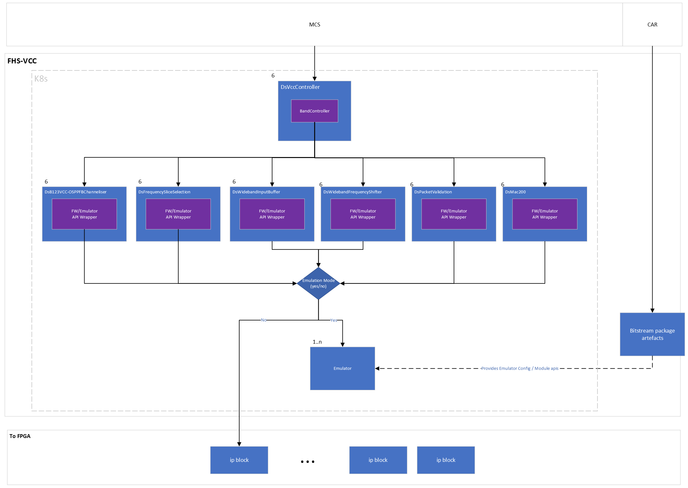

# FHS-VCC Design
## Introduction
### Purpose
This page will describe the initial design and flow of the HFS-VCC device servers with regards to the following:
1.	Design of the top level VCC Tango Device Servers running on the FHS
2.	The control interface between the MCS and FHS-VCC Controller
3.	The Emulator configuration
4.	Any design / implementation updates required by MCS

### Overview
In general, the initial design will not deviate much from that of the Talon-DX high level device servers.  The main differences will be in the device server implementation which will be ported from C++ to Python using PyTango instead.  

Along with this change is that the device servers will not run as stand-alone processes but instead will be running from within Docker containers.

The other major difference will be when the flow reaches the low-level device servers.  This will be dependent on a new state of the system which will be emulation mode.  If the system is running in emulation mode, instead of using the FW APIs in the low-level device servers to talk to the FW IP Blocks the data will be directed to use the Emulator APIs which will in turn communicate with the Emulator instead of the Agile-x hardware.

## Interface Parameters

## Configuration and Deployment
This section will outline how the high / low level device servers get configured and spun up as well as how in emulation mode the emulator also gets configured and run.

### Device Server Configuration and Deployment
The FHS device servers will be configured from .yaml files that outline the device servers and their properties.  This will follow the same procedure as that of MCS for deploying and configuring device servers.  Each VCC stack of device servers will be spun up in their own pod, this is to minimize overhead from having too many pods.  Each VCC pod will container

- vcc_all_bands
- b123_vcc_osppfb_channeliser
- frequency_slice_selection
- mac
- packet_validation
- wideband_input_buffer
- wideband_freuqency_shifter

#### Device Server .YAML Example
``` 
name: vcc
function: vcc
domain: sensing
command: "B123VccOsppfbChanneliser"
instances: ["vcc"]
depends_on:
  - device: sys/database/2
readinessProbe:
  initialDelaySeconds: 0
  periodSeconds: 10
  timeoutSeconds: 5
  successThreshold: 1
  failureThreshold: 3
livenessProbe:
  initialDelaySeconds: 0
  periodSeconds: 10
  timeoutSeconds: 5
  successThreshold: 1
  failureThreshold: 3
server:
  name: "B123VccOsppfbChanneliser"
  instances:
  - name: "vcc"
    classes:
    - name: "B123VccOsppfbChanneliser"
      devices:
      - name: "fhs/vcc/001"
        properties:
          - name: "device_id"
            values:
            - "b123vcc"
          - name: "device_version_num"
            values:
            - "0.0.1"
          - name: "device_gitlab_hash"
            values:
            - "0"
          - name: "config_location"
            values:
            - "{{ .Values.hostInfo.configLocation }}"
image:
  registry: "{{.Values.midcbf.image.registry}}"
  image: "{{.Values.midcbf.image.image}}"
  tag: "{{.Values.midcbf.image.tag}}"
  pullPolicy: "{{.Values.midcbf.image.pullPolicy}}"
  
extraVolumes:
- name: low-level-config-mount
  configMap: 
    name:  low-level-configmap
extraVolumeMounts:
  - name: low-level-config-mount
    mountPath: "{{ .Values.hostInfo.configLocation }}"
```

### Emulator Configuration
The Emulator engine requires that for each ip block needed to be emulated that an emulated version be created in python along with its state transition model.  These will live in the same repos as the FW API’s and will be pulled in from the same location in each repo to the bitstream package on build.  

A configuration file for the emulator will also be necessary that will outline the ip blocks needed and how they connect to each other in the emulator engine.  This configuration should mimic that of the FW Ip blocks.  This will also be required to be pulled into the bitstream package for use on setup.
 Once the bitstream package is built, on configuration of the FHS the bitstream package will be downloaded and the emulator ip blocks and configuration placed in a location to be mounted by the emulator engine container.
The emulator engine will then use retrieve the configuration and emulator ip blocks, use the configuration file to initiate the emulator engine configuration and set up the ip blocks with the relevant rabbitmq connections / rest endpoints.

#### Emulator Configuration .JSON Example
```
{
  "id": "vcc",
  "version": "0.0.1",
  "ip_blocks": [
    {
      "id": "dish",
      "display_name": "DISH",
      "type": "dish",
      "downstream_block_ids": [
        "ethernet_200g"
      ]
    },
    {
      "id": "ethernet_200g",
      "display_name": "200Gb Ethernet MAC",
      "type": "ethernet_mac",
      "downstream_block_ids": [
        "packet_validation"
      ],
      "constants": {
        "num_fibres": 4,
        "num_lanes": 4
      }
    },
    {
      "id": "packet_validation",
      "display_name": "Packet Validation",
      "type": "packet_validation",
      "downstream_block_ids": [
        "wideband_input_buffer"
      ],
      "constants": {
        "expected_ethertype": 65261
      }
    },
    {
      "id": "wideband_input_buffer",
      "display_name": "Wideband Input Buffer",
      "type": "wideband_input_buffer",
      "downstream_block_ids": [
        "wideband_frequency_shifter"
      ]
    },
    {
      "id": "wideband_frequency_shifter",
      "display_name": "Wideband Frequency Shifter",
      "type": "wideband_frequency_shifter",
      "downstream_block_ids": [
        "b123vcc"
      ]
    },
    {
      "id": "b123vcc",
      "display_name": "B123VCC-OSPPFB Channeliser",
      "type": "b123vcc_osppfb_channeliser",
      "downstream_block_ids": [
        "fs_selection_26_2_1"
      ]
    },
    {
      "id": "fs_selection_26_2_1",
      "display_name": "Frequency Slice Selection 26 x 2:1 MUX",
      "type": "frequency_slice_selection",
      "downstream_block_ids": [
        "fs_selection_26_6"
      ],
      "constants": {
        "num_inputs": 52,
        "num_outputs": 26
      }
    },
    {
      "id": "fs_selection_26_6",
      "display_name": "Frequency Slice Selection 26:6 MUX",
      "type": "frequency_slice_selection",
      "downstream_block_ids": [],
      "constants": {
        "num_inputs": 26,
        "num_outputs": 6
      }
    }
  ],
  "first": "dish"
}
```


## Low-Level Device Servers APIs
The main change between low-level device servers on the Talon HPS and new Agile-x FHS is that the register maps are no longer generated by registerDef and accessed through attributes in the device server.  
These have been moved out into tango-agnostic C++ API’s.  These APIs are then used with pybind to create python bindings for the API which can be used by the pytango device server.
In turn a corresponding emulator api that matches the C++ API functions is also needed to be created to call the relevant emulator endpoints.
These two API’s the C++ python bindings and the emulator API are wrapped in a python wrapper class which inherits an interface to ensure that both have the necessary corresponding functions.  
Depending on whether the system is in emulation mode or not, the wrapper will instantiate the correct API.  If in emulator mode the emulator API , if not the FW API.  This allows the device server to continue to work as required by abstracting the API behaviour underneath.

## Architechture Design
### High-Level FHS-VCC Design


## Design Considerations
### Multi threaded / process for Band Devices
It could be beneficial for band devices that instead of spinning up multiple device servers in k8s pods that are controlled by the DsVccController process as threads running the band device servers.  This will allow for better control over the band devices and save resource usage by not needing a container and pod for each band device.

### Single Pod for Each VCC
To minimize overhead and pod clutter the VCC stack of Device Servers will be loaded into a single pod.  This pod will include:
 


