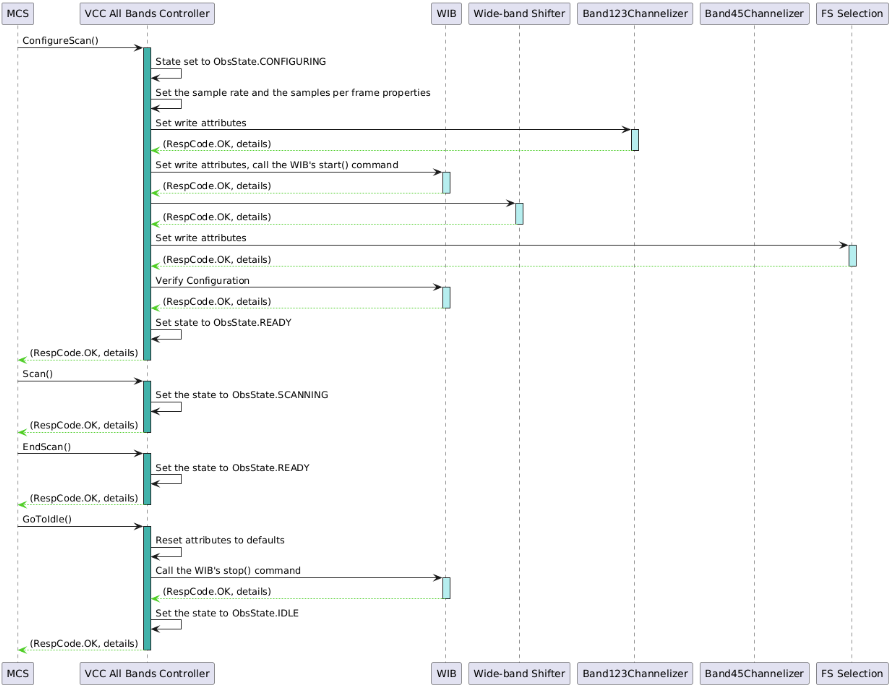

# FHS-VCC All Bands Controller - ICD MCS to FHS-VCC
### Overview
This document serves as the internal ICD between MCS and the FHS-VCC. The FHS-VCC All Bands Controller provides the control layer between MCS and the subordinate FHS-VCC devices. Implemented as a Tango Device server using the 1.0.0+ version of the ska-tango-base classes.
### Scenario Diagram 

### Device Attributes

| Name                          | Type                                                      | Read/Write | Description                                                                                                                                                      |
| ----------------------------- | --------------------------------------------------------- | ---------- | ---------------------------------------------------------------------------------------------------------------------------------------------------------------- |
| `dishID`                      | DevString                                                 | R          | Associated dish identifier                                                                                                                                       |
| `vccGains`                    | `Array<Array<Tango::DevDouble>>` | R          | Read attribute for gain values of size `[n=number of sub-bands][m=2*number of channels]`.                                                                                                                                   |
| `frequencyBand`               | DevEnum                                                   | R          | Frequency band that is currently configured                                                                                                                      |
| `configID`                    | DevString                                                 | R          | Identifier of the current scan configuration                                                                                                                     |
| `scanID`                      | DevULong                                                  | R          | Identifier of the current scan                                                                                                                                   |
| `inputSampleRate`             | DevULong64                                                | R          | Input sample rate read attribute                                                                                                                                 |
| `frequencyBandOffset`           | DevLong[2]                                                | R          | Frequency band offset, received during scan configuration      Length 2 since band 5 needs two values specified, other bands will only use the first value |
| `requestedRFIHeadroom`          | Scalar                                                    | R/W        | Requested RFI Headroom to be applied when Auto-set gains is requested (default: 3dB)                                                                             |
| `subarrayID`                    | Scalar                                                    | R          | Current Subarray the VCC is a member of.                                                                                                                         |
| `noiseDiodeMeasurementInterval` | Scalar                                                    | R/W        | The measurement interval is provided as an integer number of samples at the channel resolution where the power is being measured                                 |
| `noiseDiodeReportingInterval`   | Scalar                                                    | R/W        | The reporting interval is an integer number of measurement intervals                                                                                             |

#### Device Properties
| Name                           | Type                            | Description                                                                                                              |
| ------------------------------ | ------------------------------- | ------------------------------------------------------------------------------------------------------------------------ |
| `vcc123ChannelizerFQDN`        | DevString                       | Fully Qualified Domain name (FQDN) for the 1,2& 3 OSPPFB Channelizer lower level device                                  |
| `vcc45_1ChannelizerFQDN`       | DevString                       | FQDN for the 4&5 stream 1 OSPPFB Channelizer lower level device                                                          |
| `vcc45_2ChannelizerFQDN`       | DevString                       | FQDN for the 4&5 stream 2 OSPPFB Channelizer lower level device                                                          |
| `vcc123PowerMeterFQDN`         | DevString                       | FQDN for the Wideband Power Meter for B123                                                                               |
| `vcc45_1PowerMeterFQDN`        | DevString                       | FQDN for the Wideband Power Meter for B45.1                                                                              |
| `vcc45_2PowerMeterFQDN`        | DevString                       | FQDN for the Wideband Power Meter for B45.2                                                                              |
| `fsPowerMeters`                | Array of DevStrings (size = 26) | FQDNs for the FS powers meters on each of the 26 lanes following the FS Selection IP BIock                               |
| `fsPacketizerFQDN`             | DevString                       | FQDN for the FS Packetizer                                                                                               |
| `fsSelectionFQDN`              | DevString                       | FQDN for the FS Selection lower level device                                                                             |
| `widebandFrequencyShifterFQDN` | DevString                       | FQDN for Wideband Frequency Shifter lower level device                                                                   |
| `widebandInputBufferFQDN`      | DevString                       | FQDN for Wideband Frequency Input Buffer lower level device                                                              |
| `macFQDN   `                   | DevString                       | FQDN for Ethernet Media Access Control (MAC) lower level device likely only needed for testing purposes in loopback mode |
### Commands
| Name                                | Input Type  | Input Parameter                                | Allowed in modes      | Description                                                                                                                                                                                                                                                                                                                                                                                               |
| ----------------------------------- | ----------- | ---------------------------------------------- | --------------------- | --------------------------------------------------------------------------------------------------------------------------------------------------------------------------------------------------------------------------------------------------------------------------------------------------------------------------------------------------------------------------------------------------------- |
| `ConfigureScan()`                   | JSON String | See below.                                     | IDLE, READY           | Configure parameters for the next scan(s). Parameters are propagated down to low-level device servers. Sets the state to CONFIGURING, if the inputted JSON can be successfully parsed the state is set to READY.                                                                                                                                                                                          |
| `Scan()`                            | String      | The identifier of the current scan             | READY                 | Start the scan using the last set of parameters passed via the `ConfigureScan()` command. The state is then set to SCANNING.    If Transient Buffer Capture (TBC) is configured, scan will begin buffering of FS packets dependent on the number of configured search windows.                                                                                                                                                                                                                                                                             |
| `GoToIdle()`                        | void        | n/a                                            | READY                 | Resets the device and changes the state to IDLE                                                                                                                                                                                                                                                                                                                                                           |
| `Abort()`                           | void        | n/a                                            | IDLE, READY, SCANNING | Sets the device state to ABORTED and aborts all running/queued commands                                                                                                                                                                                                                                                                                                                                   |
| `EndScan()`                         | void        | n/a                                            | SCANNING              | Completes the scan and changes the device back to the READY state.    If Transient Buffer Capture is configured, ending the scan will stop buffering packets and clear the applicable buffers.                                                                                                                                                                                                                                                                                                                                   |
| `ObsReset()`                        | void        | n/a                                            | ABORTED, FAULT        | Reset the observing device from a FAULT/ABORTED obsState to IDLE. Initially sets the state to RESETTING, resets the configuration of the device to the default and then sets the state to IDLE on completion.                                                                                                                                                                                             |
| `AutoSetFilterGain()`                 | Scalar      | Requested RFI headroom.                        | SCANNING              | This command triggers the algorithm to determine and adjust filter gains and levels and takes as input the optional parameter Headroom.                                                                                                                                                                                                                                                                   |
| `AutoSetTBCGain()`                    | Scalar      | Dwell Time                                     | SCANNING              | This command triggers algorithm that measures and adjusts Transient Buffer Capture (TBC) re-quantizer gain settings to provide optimal sensitivity. ‘Dwell time” specifies how long to integrate to determine the quantizer gain settings (seconds).   Applies gain corrections on fine channels.                                                                                                   |
| `UpdateSubarrayMembership()`          | int         | Subarray ID                                    |                       | Command to update the current subarray membership of the VCC. If the VCC is not currently assigned to a subarray, it's membership is updated setting the subarray_id attribute and if the current subarray_id > 0 indicating the VCC has already been assigned to a differing subarray the command is REJECTED.      Subarray membership can also be cleared by assigning a subarray_id equal to 0. |
| `OffloadTransientDataCapture()`       | Timestamp   | Starting epoch to begin transient data capture | SCANNING              | Commands triggers the offload of transient data for the given VCC, offloads data relative to the start time of the capture and the duration configured within the scan. On command execution writing to the transient buffer is locked and iterated over to construct a capture with from provided start time to the start time + duration before it is transmitted over the 400GbE to SDP.               |
| `UpdateDelayModels()`                 | JSON string | See below.                                     | READY, SCANNING       | Update delay tracking with new High order delay models required for PSS processing.                                                                                                                                                                                                                                                                                                                       |
| `GetBandpassCorrectionCoefficients()` | int         | Optional - Index for a frequency band {1-6}    | N/A                   | Returns a 2-Dimensional list of previously set auto-set gains.   - Valid band index provided - Returns a 2-Dim arr with at index 0 the gains applied for the given band - Valid band index provided with no prior scan for that band - Returns an empty list - No index provided - Returns a 2-Dim arr of format [i → frequency band, j → gain value for channel i, pol % 2]                  |                                                                                     |
### Command Parameter Definitions
#### `UpdateSubarrayMembership(int)`
##### Parameters
| Name                | Type                                   | Description | Range |
| ------------------- | -------------------------------------- | ----------- | ----- |
| subarray_id  | int                                 | Subarray ID to assign VCC to. If value == 0 the subarray membership of the VCC is reset.            | 0-16      |
##### Returns
Returns `ResultCode.OK` if the VCC could be successfully assigned or the value has been cleared. The command is a LRC to ensure no race conditions can occur between subarrays.
##### Errors
Returns `ResultCode.REJECTED` if the VCC is already assigned to a subarray and the ID provided is not equal to 0. Membership must be cleared before reassignment.
#### `ConfigureScan()`
##### Parameters
| Name                                   | Type                                                                   | Description                                                                                                                                                                                                                                                                                                                                                                                                                                                                                                                | Range                                                                                                                              |
| -------------------------------------- | ---------------------------------------------------------------------- | -------------------------------------------------------------------------------------------------------------------------------------------------------------------------------------------------------------------------------------------------------------------------------------------------------------------------------------------------------------------------------------------------------------------------------------------------------------------------------------------------------------------------- | ---------------------------------------------------------------------------------------------------------------------------------- |
| `config_id`                            | string                                                                 | Identifier of the current scan configuration                                                                                                                                                                                                                                                                                                                                                                                                                                                                               |                                                                                                                                    |
| expected_dish_id                       | string                                                                 | Expected Dish ID for the VCC                                                                                                                                                                                                                                                                                                                                                                                                                                                                                               | MKT000-MKT063 or   SKA001-SKA133                                                                                                |
| `frequency_band`                       | string                                                                 | Frequency band for the current scan                                                                                                                                                                                                                                                                                                                                                                                                                                                                                        | ("1","2","5a","5b")                                                                                                                |
| `frequency_band_offset_stream_1`       | long                                                                   | See `frequencyBandOffset` attribute description                                                                                                                                                                                                                                                                                                                                                                                                                                                                            |  |
| `frequency_band_offset_stream_2`       | long                                                                   | See `frequencyBandOffset` attribute description                                                                                                                                                                                                                                                                                                                                                                                                                                                                            |  |
| b123_power_meter                       | `PowerMeterConfig{"averaging_time", "flagging"}`                       | Configuration for the wideband power meter pre-B123 OSPPFB Channelizer                                                                                                                                                                                                                                                                                                                                                                                                                                                     |                                                                                                                                    |
| b45_1_power_meter                      | `PowerMeterConfig{"averaging_time", "flagging"}`                       | Configuration for the wideband power meter pre-B45 sub-band 1 OSPPFB Channelizer                                                                                                                                                                                                                                                                                                                                                                                                                                           |                                                                                                                                    |
| b45_2_power_meter                      | `PowerMeterConfig{"averaging_time", "flagging"}`                       | Configuration for the wideband power meter pre-B45 sub-band 2 OSPPFB Channelizer                                                                                                                                                                                                                                                                                                                                                                                                                                           |                                                                                                                                    |
| `fs_lanes`                               | Array of FSLaneConfig(size = 26)                                       | Configuration the set of 26 FS power meters, each element specifies config for relative to an FS lane following the FS Selection handling either 10 FS in Band 1&2, 15 in Band 4 or 26 in Band 5 (a or b).                                                                                                                                                                                                                                                                                                                 |                                                                                                                                    |
| `fs_select_start_channels`               | Array of int {0-2} (size = 2)                                          | Required in band 5 (a or b) the two streams produce 15 frequency slices each through the B45.1 and B45.2 channelizers for a total of 30 frequency slices however, only 26 outputs are available within the FS selection IP block. Therefore, the start channel index is used to mitigate the number of FSs for both streams.      fs_select_start_channel[0] → sets the starting index for 13 FS selected from stream 1  fs_select_start_channel[1] → sets the starting index for 13 FS selected from stream 2 |                                                                                                                                    |
| `band_5_tuning or stream_tuning`       | Array of Floats                                                        | Center frequency for the band-of-interest. Required if band is 5a or 5b; not specified for other bands                                                                                                                                                                                                                                                                                                                                                                                                                     | 5A: 5.85 to 7.25 GHz   5B:  9.55 to 14.05 GHz                                                                                   |
| `noise_diode_transition_holdoff_count` | float                                                                  | Number of sample frames that indicates the worst case state transition in the event of packet loss/corruption within the Wideband Input Buffer      NOTE: Make this seconds which will have a different set of ranges. likely be tiny.                                                                                                                                                                                                                                                                               | 0 to 65535                                                                                                                         |
| `dish_sample_rate`                     | uint64_t                                                               | Dish sample rate factoring in the frequency band and the freq_offset_k                                                                                                                                                                                                                                                                                                                                                                                                                                                     | 3,960,001,800 to 11,891,998,800                                                                                                    |
| `vcc_gains_stream_1`                   | Array of DevDouble (size = `num_vcc_channels_` * `num_polarizations_`) | Specifies the gain of each channel in the VCC for stream 1 (e.g. VCC-B123 OSPPFB or VCC-B45 OSPPFB 1)                                                                                                                                                                                                                                                                                                                                                                                                                      | When frequency band is:  12&3 → Size = 20, or,  4, 5a/5b → Size = 30                                                   |
| `vcc_gains_stream_2`                   | Array of DevDouble (size = `num_vcc_channels_` * `num_polarizations_`) | Specifies the gain of each channel for the VCC-B45 OSPPFB 2                                                                                                                                                                                                                                                                                                                                                                                                                                                                | Size = 30                                                                                                                          |
| `is_pss`                                 | bool                                                                   | Is PSS configured?                                                                                                                                                                                                                                                                                                                                                                                                                                                                                                         |                                                                                                                                    |
| `pss`                                    | PSSConfig                                                              | Specifies the config is PSS is needed                                                                                                                                                                                                                                                                                                                                                                                                                                                                                      |                                                                                                                                    |

**FS Lane Config Definition**:

| Name      | Type   | Description                                                                                                                                                                                                                                                                          | Range                                                 |
| --------- | ------ | ------------------------------------------------------------------------------------------------------------------------------------------------------------------------------------------------------------------------------------------------------------------------------------ | ----------------------------------------------------- |
| vlan_id   | uint16 | VLAN identifier for use in network switch map to the given FS to an FSP (Used for the Packetizer)                                                                                                                                                                                    | $[[2, 1001], [1006, 4094]]$                           |
| fs_id     | int    | Identifier of the frequency slice                                                                                                                                                                                                                                                    | $[1,26]$                                              |
| averaging | float  | Averaging interval in seconds. The power meters implement a block moving average, when interval `t` ends the accumulated power is divided by `t` to produce an average power value. The power accumulators are then reset to start a new block average. (Used for PowerMeter[fs_id]) |                                                       |
| flagging  | int    | The flagging mode used for handling flagged data used to configure PowerMeter[fs_id]                                                                                                                                                                                                 | 0 - Ignore  1 - Use  2 - Saturate and use |

**PSS Config**
| Name                 | Type                                      | Description                                                                                                                                                                                                                                                                          | Range      |
| -------------------- | ----------------------------------------- | ------------------------------------------------------------------------------------------------------------------------------------------------------------------------------------------------------------------------------------------------------------------------------------ | ---------- |
| search_window        | Array of SearchWindow Config (max_size=2) | Placeholder for future Search Window configuration.                                                                                                                                                                                  |            |
| rdt                  | JSON Object (format RDT Config)           | See below definition.                                                                                                                                                                                                                                                                |            |
| is_tbc               | bool                                      | Is Transient Buffer capture required?                                                                                                                                                                                                                                                |            |
| tbc_duration         | int                                       | Averaging interval in seconds. The power meters implement a block moving average, when interval `t` ends the accumulated power is divided by `t` to produce an average power value. The power accumulators are then reset to start a new block average. (Used for PowerMeter[fs_id]) | 22s or 44s |
| tbc_bit_size         | int                                       | The bit size of the FS to be requantized to for use in the buffers.                                                                                                                                                                                                                  | 4 or 8     |
| tbc_destination_addr | string                                    | Destination address for offload of transient buffer data. This must be validated to map to the SDP port, due this **TBD** if we need to provide this configuration option if we know the destination.                                                                                |            |

**RDT Config**
| Name                               | Type   | Description                                                                                                                                                                                                                                                                                                                                          | Range |
| ---------------------------------- | ------ | ---------------------------------------------------------------------------------------------------------------------------------------------------------------------------------------------------------------------------------------------------------------------------------------------------------------------------------------------------- | ----- |
| input_sample_rate                  | long   | The sample rate of the incoming signal.                                                                                                                                                                                                                                                                                                              | >= 0  |
| output_sample_rate                 | long   | The desired sample rate of the outgoing signal.                                                                                                                                                                                                                                                                                                      | >= 0  |
| fo_validity_interval               | double | The duration, in seconds, for which each FODM should be valid, i.e., this should represent the difference between each FODM's start_ts and stop_ts. Default is 0.01 (10ms).                                                                                                                                                                          | >= 0  |
| fo_fill_threshold                  | long   | The "needs filling" threshold of elements in the FW circular buffer, below which the DS will start generating and loading more FODMs into the FW. Default is 3000 (30 seconds of 10ms FODMs).                                                                                                                                                        | >= 0  |
| fo_low_threshold                   | long   | The "low" threshold of elements in the FW circular buffer, below which the DS will move to a DEGRADED HealthState. Default is 500 (5 seconds of 10ms FODMs).                                                                                                                                                                                         | >= 0  |
| first_input_timestamp_start_offset | double | The time offset, in seconds, which is added to the current timestamp of the IP to determine the minimum allowed start timestamp, rounded up to the next PPS, for FODMs to be provided to the FW driver (which then loads them into the circular buffer). All FODMs generated with start timestamps before this calculated minimum will be discarded. | >= 0  |
| num_lsq_points                     | long   | The number of points to use in the Least Squares (LSQ) linear fitting algorithm for converting HODMs to FODMs. Default is 100.                                                                                                                                                                                                                       | >= 0  |
| freq_down_shift                    | double | The frequency downshift that was applied to the input signal in the VCC IP(?).                                                                                                                                                                                                                                                                       |       |
| freq_align_shift                   | double | A fine frequency shift to additionally apply to the output signal. This covers any residual wideband frequency shift and alignment of channels between frequency slices.                                                                                                                                                                             |       |
| freq_wb_shift                      | double | The wideband (WB) frequency shift that was applied to the input signal in the Frequency Shifter IP(?).                                                                                                                                                                                                                                               |       |
| freq_scfo_shift                    | double | The frequency shift required due to SCFO sampling. (TODO: Need more detail?)                                                                                                                                                                                                                                                                         |       |
##### Returns
Implmented as a LRC once the task has completed for a successful command completion, the command with return `ResultCode.OK` and message `ConfigureScan completed OK` 
##### Errors
Bad Request: provided configuration does not match required JSON schema definition or input critieria for a specific band. Returns `ResultCode.REJECTED` and message: `Arg provided does not meet ConfigureScan criteria: {reason}`

State Model violation: there was an attempt to call a command that violates the current ObsState. Returns `ResultCode.REJECTED` and message `Attempted to call ConfigureScan command from an incorrect state`

Low-level device failure: error configuring a IP block low-level device. Returns `ResultCode: REJECTED, message: Configuration of low-level fhs device failed: {device name}`

Server Error: unexpected error occured on server. Returns `ResultCode: FAILED, message: Failed to an unexpected exception during ConfigureScan`

#### `Scan()`
##### Parameters
| Name     | Type   | Description                    |
| -------- | ------ | ------------------------------ |
| `scan_id` | string | Identifier of the current scan |

#### `UpdateDelayModels(Devstring)`
##### Parameters
| Name                | Type                                   | Description | Range |
| ------------------- | -------------------------------------- | ----------- | ----- |
| start_validity_sec  | Double                                 |             |       |
| cadence_sec         | Double                                 |             |       |
| validity_period_sec | Double                                 |             |       |
| config_id           | String                                 |             |       |
| subarray            | Integer                                |             |       |
| receptor_delays     | Array of JSON (format Receptor Delays) |             |       |

**Receptor Delays Config**
| Name            | Type             | Description                               | Range |
| --------------- | ---------------- | ----------------------------------------- | ----- |
| receptor        | uint16           | Receptor id to update the delay model for | TBD   |
| xypol_coeffs_ns | Vector of Double |                                           |       |
| ypol_offset_ns  | Double           |                                           |       |
#### `GoToIdle()` 
##### Parameters
n/a
#### `EndScan()`
##### Parameters
n/a

#### `AutoSetFilterGains(int)`
##### Parameters
| Name                | Type                                   | Description | Range |
| ------------------- | -------------------------------------- | ----------- | ----- |
| requested_rfi_headroom  | int - Optional                                 | Requested RFI Headroom to be accounted for pre-requantization (default: 3 dB)           |       |

#### `OffloadTransientBufferCapture(DevLong)`
##### Parameters
| Name                | Type                                   | Description | Range |
| ------------------- | -------------------------------------- | ----------- | ----- |
| epoch_start_time  | long                                 | Epoch start time to begin transient buffer capture            |       |

#### `GetBandpassCorrectionCoefficients(int) - Fast Command`
##### Parameters
| Name                | Type                                   | Description | Range |
| ------------------- | -------------------------------------- | ----------- | ----- |
| band_id  | int - Optional                                 | Frequency Band of interest for retrieving gain corrections (uses same definition as Frequency Band used within ConfigureScan)            |  1-6     |
##### Returns
Returns a `Float[][][]` of digital bandpass corrections for the specified of `band_id`. 

If a `band_id` is not provided All gains corrections are returned of the format `[i → frequency band, j → gain value for channel i, pol % 2]`
#### `Abort()`
##### Parameters
n/a

#### `ObsReset()`
##### Parameters
n/a

### Design decisions
1. On the new Agilex architecture switching frequency bands for a VCC can be done by partial reconfiguration of the FPGA board, the previous design had a top level device controller and a device per band, with it now being easier to switch bands that design can be simplified to have one top level device per VCC. Thus for this ICD the functionality between what was previously the DS-VCC-Controller and the DSVccBand1and2 has been merged. The main function merger was  between the `ConfigureBand()` and the `SetInternalParameters()` functions, both of which were called in close sequence by the control software but, were previously on different devices servers. The attributes for both are now shared.
2. Also the need for a VCC base class has also been reduced at the top level therefore the attributes are merged into the one core class.
3. Following design decisions made for MCS, setting `AdminMode = ONLINE` will be utlized to handle previous `On()` command functionality and setting `AdminMode = OFFLINE` will be used to handle the functionality of the previously implemented `Disable()` command.
4. Implementation specific comments:
- All commands apart from power-related On/Off commands will be implemented as fast commands
- By implementing with PyTango it should allow the removal of the MCS VCC device, this will require changes to the MCS subarray device as commands will have to be changed to target the FHS device. Also threads will have to be allocated within the device to accomodate long runnning commands across multiple VCCs