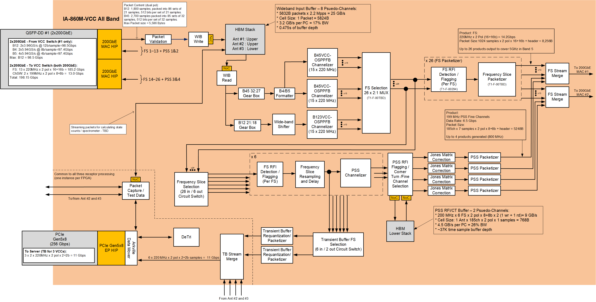

.. skeleton documentation master file, created by
   sphinx-quickstart on Thu May 17 15:17:35 2018.
   You can adapt this file completely to your liking, but it should at least
   contain the root `toctree` directive.

.. HOME SECTION ==================================================

.. Hidden toctree to manage the sidebar navigation.

.. toctree::
  :maxdepth: 2
  :caption: Home
  :hidden:

.. README =============================================================

.. This project most likely has it's own README. We include it here.

.. toctree::
   :maxdepth: 2
   :caption: Readme

   ../../README

.. COMMUNITY SECTION ==================================================
..

.. toctree::
  :maxdepth: 2
  :caption: Package name
  :hidden:

  package/guide

.. toctree::
  :maxdepth: 2
  :caption: Initial SDD

  design/fhs-vcc-design

Project-name documentation HEADING
==================================

These are all the packages, functions and scripts that form part of the project.

- :doc:`package/guide`

Firmware Interfaces
===================
Guides for the various Software controlable blocks in the Firmware. These describe the interface to higher level control software (a SW API). Behind this API is either
1. driver software that converts the configuration, control, and status commands to appropriate reads and writes to the FPGA registers.
2. emulator software that mimics the behaviour of the FPGA block.

The API for the low-level driver will primarily be defined by three data structures:
1. `param` - the instance parameters which define a particular instance of a FW block. This is passed to the constructor.
2. `config` - defines the runtime control parameters for the FW block. This is used to configure the registers that control the function of the FW block.
3. `status` - holds information about the current status of the FW block, error reports, counters, etc. This information is retrieved from the FW blocks.

These structures will have fields that match the abstracted function of the FW block. The low-level driver is responsible for translating the fields into appropriate register writes and reads. The structures should not be a simple one-to-one correspondence with the registers.

Standard low-level API functions
--------------------------------

`constructor(param : struct)`
^^^^^^^^^^^^^^^^^^^^^^^^^^^^^
This function creates a instance of a driver. The param struct provides system level constants, block constants. It may also read constants from its associated register sets.
- sets a unique identifier name - this may be used in log messages.
- set the base address(es) of the register sets.
- memory-maps the register set(s)
- reads any information from the register sets.
- Does any other pre-computation.

`recover()`
^^^^^^^^^^^
- This function is to recover the FW block back to a power-on state.
  - possibly apply a reset (if available) 
  - possibly apply default register settings.
  - possibly release a reset.

`configure(config : struct)`
^^^^^^^^^^^^^^^^^^^^^^^^^^^^
This function provides runtime configuration of the FW block. Settings are applied immediately. If for any reason the settings cannot be applied immediately then an exception should be raised.
- fields in the config struct should first be validated, before any registers are written. If validation fails, the an exception should be raised.
- if significant computation is required, then this should be done before any registers are written.
- registers are then written.

`start()`
^^^^^^^^^
This function may be used to start the FW block operating.
- If the block must first be configured, then an exception should be raised.
- Most FW blocks will operate continuously, in which case this function may not write any register, and do nothing.
- Repeated calling of this function will do nothing if already started.

Returns:
- 0: successfully stopped (or did nothing).
- 1: stopping - poll `stop()` until 0 returned.

`stop(force: bool := False)`
^^^^^^^^^^^^^^^^^^^^^^^^^^^^
This function may be used to stop the FW block operating.
- Most FW blocks will operate continuously, in which case this function may not write any register, and do nothing.
- For some FW blocks this may put a module into reset.
- It may take some time for a module to stop.
- The force field may be used to more forcibly stop a module, rather than let it finish it's current processing step. This may be dangerous.
- raises an exception if it cannot stop

Returns:
- 0: successfully stopped (or did nothing).
- 1: stopping - poll `stop()` until 0 returned.

`deconfigure(config: struct)`
^^^^^^^^^^^^^^^^^^^^^^^^^^^^^
This function provides runtime deconfiguration of a FW block. Some blocks have independent control of different sections, this allows those sections to be independently disabled.
- Pass the same data as `configure()`, but results in removal of that configuration and reinstatement of a default (unconfigured) state.
- Will result in immediate action.
- raise Exception if cannot deconfigure, or config is invalid.

`status(status: &struct, clear:bool := False)`
^^^^^^^^^^^^^^^^^^^^^^^^^^^^^^^^^^^^^^^^^^^^^^
This function returns ALL status.
- activate any atomic capture of state information (snapshot).
- populate the status struct with relevant information.
- if clear=True then reset any sticky status bits.

VCC Bitstream
-------------

For the VCC-only stage of the bitstream, the APIs for the blocks in the top half of the image will exist:

* 200Gb :doc:`blocks/Ethernet_MAC`
* :doc:`blocks/Packet_Validation`
* :doc:`blocks/Wideband_Input_Buffer`
* :doc:`blocks/Wideband_Frequency_Shifter`
* :doc:`blocks/B123VCC-OSPPFB_Channelizer`
* B45VCC-OSPFFB Channeliser - see B123VCC-OSPPFB_Channelizer
* :doc:`blocks/Frequency_Slice_Selection`
* FS RFI Detection and Flagging

In addition for the VCC-PSS stage of the bitstream, the APIs for the blocks in the top two thirds of the image will exist, adding

* Frequency Slice Resampling and Delay Tracking
* PSS Channelizer
* PSS RFI Flagging/Corner Turn/Fine Channel Selection
* Jones Matric Correction

Finally for the VCC-PSS-TB stage of the bitstream, the APIs for the blocks in the top two thirds of the image will exist, adding

* Transient Buffer Requantization

.. toctree::
  :maxdepth: 2
  :caption: Package name
  :hidden:
  
  blocks/Ethernet_MAC
  blocks/Packet_Validation
  blocks/Wideband_Input_Buffer
  blocks/Wideband_Frequency_Shifter
  blocks/B123VCC-OSPPFB_Channelizer
  blocks/Frequency_Slice_Selection
  blocks/Template_Block